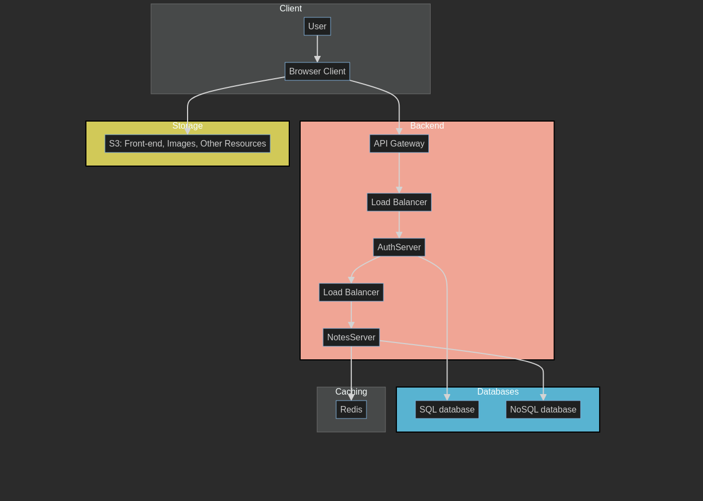

# Note App

The "note-app" is an application designed to store user notes, providing a convenient and easy way for users to make personal annotations.

The application aims the process of note-taking, ensuring users can efficiently manage and retrieve their notes with minimal effort.

## Wireframes

## Sequence diagram

## API reference (Open API)

## Entity Relationship diagram

## Architecture diagram

## Cost Estimate

| AWS Service                     | Estimated Cost / quantity               | Notes                                                                                                                  |
|---------------------------------|-----------------------------------------|------------------------------------------------------------------------------------------------------------------------|
| Application Load Balancer       | $19.31/month                            | $0.02646 per Application Load Balancer-hour (or partial hour)                                                          |
| RDS for SQL (db.t3.medium)      | $52.56/month                            | Suitable for light to moderate workloads with occasional bursts. (2 vCPUs, 4 GiB RAM)                                  |
| Amazon DocumentDB (db.r5.large) | $202.21 / month per 10million registers | Suitable for small to moderate workloads, providing a good balance between cost and performance. (2 vCPUs, 16 GiB RAM) |
| API Gateway                     | $3.50/million requests                  | First 1M requests/month are free, after that, it's $3.50 per 1 million request.                                        |
| ElastiCache (Redis)             | Variable                                | Dependent on node size and time running                                                                                |
| EKS (kubernetes)                | $73.00/month for 1 cluster              |                                                                                                                        |
---
